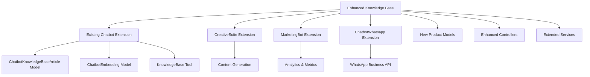

# Design Document

## Overview

The Enhanced Knowledge Base with Product Catalog feature extends the existing Chatbot extension's knowledge base system by integrating e-commerce capabilities, multimedia support, and intelligent content generation. This design leverages existing extensions (Chatbot, CreativeSuite, MarketingBot, ChatbotWhatsapp) and follows the established Laravel architecture patterns.

## Architecture

### System Integration Overview



### Database Schema Extensions

The design extends existing tables and adds new ones while maintaining backward compatibility:

**Extended Tables:**
- `ext_chatbot_knowledge_base_articles` - Add multimedia and product linking fields
- `ext_chatbot_embeddings` - Add product-specific embedding types

**New Tables:**
- `ext_chatbot_products` - Product catalog information
- `ext_chatbot_product_categories` - Product categorization
- `ext_chatbot_social_content` - Social media imported content
- `ext_chatbot_analytics` - Usage metrics and analytics
- `ext_chatbot_whatsapp_business` - Native WhatsApp Business API configuration

## Components and Interfaces

### 1. Product Catalog System

**ProductCatalogService**
- Manages product import/export (CSV, JSON, API)
- Handles product-knowledge base linking
- Provides product search and filtering
- Integrates with existing ChatbotService

**ChatbotProduct Model**
```php
class ChatbotProduct extends Model
{
    protected $fillable = [
        'user_id', 'chatbot_id', 'name', 'description', 'price',
        'sku', 'category_id', 'image_url', 'purchase_url',
        'availability', 'stock_quantity', 'metadata'
    ];
    
    public function knowledgeBaseArticles()
    public function category()
    public function chatbot()
}
```

### 2. Enhanced Knowledge Base

**Extended ChatbotKnowledgeBaseArticle Model**
- Add fields: `media_urls`, `product_ids`, `content_type`, `interactive_elements`
- Maintain existing relationships and methods
- Add new methods for multimedia and product handling

**Enhanced KnowledgeBase Tool**
- Extend existing `app/Extensions/Chatbot/System/Tools/KnowledgeBase.php`
- Add product-aware search capabilities
- Include multimedia content in responses
- Integrate with social media content

### 3. Content Generation System

**ContentGenerationService**
- Leverages CreativeSuite extension for content creation
- Analyzes conversation patterns to identify content gaps
- Generates product descriptions and FAQ articles
- Uses existing AI models and embedding systems

### 4. Analytics and Metrics

**AnalyticsService**
- Extends MarketingBot analytics capabilities
- Tracks knowledge base usage patterns
- Monitors content effectiveness
- Provides insights for content optimization

**ChatbotAnalytics Model**
```php
class ChatbotAnalytics extends Model
{
    protected $fillable = [
        'chatbot_id', 'article_id', 'query', 'channel',
        'response_time', 'user_satisfaction', 'conversion',
        'session_id', 'metadata'
    ];
}
```

### 5. Social Media Integration

**SocialMediaService**
- Connects to social platform APIs
- Imports and processes social content
- Creates knowledge base articles from social posts
- Maintains content freshness and relevance

### 6. Native WhatsApp Business API

**WhatsAppBusinessService**
- Replaces Twilio dependency in existing ChatbotWhatsapp extension
- Implements Meta Business API integration
- Supports advanced WhatsApp Business features
- Maintains backward compatibility with existing conversation flows

## Data Models

### Product Catalog Schema

```sql
-- Products table
CREATE TABLE ext_chatbot_products (
    id BIGINT PRIMARY KEY AUTO_INCREMENT,
    user_id BIGINT NOT NULL,
    chatbot_id BIGINT NULL,
    name VARCHAR(255) NOT NULL,
    description TEXT,
    price DECIMAL(10,2),
    sku VARCHAR(100),
    category_id BIGINT,
    image_url TEXT,
    purchase_url TEXT,
    availability ENUM('in_stock', 'out_of_stock', 'discontinued'),
    stock_quantity INT DEFAULT 0,
    metadata JSON,
    created_at TIMESTAMP,
    updated_at TIMESTAMP,
    FOREIGN KEY (user_id) REFERENCES users(id),
    FOREIGN KEY (chatbot_id) REFERENCES ext_chatbots(id),
    FOREIGN KEY (category_id) REFERENCES ext_chatbot_product_categories(id)
);

-- Product categories
CREATE TABLE ext_chatbot_product_categories (
    id BIGINT PRIMARY KEY AUTO_INCREMENT,
    user_id BIGINT NOT NULL,
    name VARCHAR(255) NOT NULL,
    description TEXT,
    parent_id BIGINT NULL,
    created_at TIMESTAMP,
    updated_at TIMESTAMP,
    FOREIGN KEY (user_id) REFERENCES users(id),
    FOREIGN KEY (parent_id) REFERENCES ext_chatbot_product_categories(id)
);
```

### Enhanced Knowledge Base Schema

```sql
-- Extend existing knowledge base articles table
ALTER TABLE ext_chatbot_knowledge_base_articles 
ADD COLUMN media_urls JSON AFTER content,
ADD COLUMN product_ids JSON AFTER media_urls,
ADD COLUMN content_type ENUM('text', 'multimedia', 'product', 'social') DEFAULT 'text',
ADD COLUMN interactive_elements JSON AFTER content_type,
ADD COLUMN source_platform VARCHAR(50) AFTER interactive_elements,
ADD COLUMN last_updated_from_source TIMESTAMP NULL;
```

## Error Handling

### Graceful Degradation
- If product catalog is unavailable, fall back to standard knowledge base
- If multimedia content fails to load, provide text alternatives
- If social media APIs are down, use cached content
- If WhatsApp Business API fails, fall back to existing Twilio integration

### Error Recovery
- Implement retry mechanisms for API calls
- Cache frequently accessed content
- Provide meaningful error messages to users
- Log errors for debugging and improvement

## Testing Strategy

### Unit Testing
- Test each new model and service independently
- Mock external API dependencies
- Validate data transformations and business logic
- Test backward compatibility with existing features

### Integration Testing
- Test interaction between enhanced knowledge base and existing chatbot
- Verify product catalog integration with conversation flows
- Test multimedia content delivery across channels
- Validate analytics data collection and reporting

### End-to-End Testing
- Test complete user journeys from product inquiry to purchase
- Verify cross-channel conversation continuity
- Test content generation and approval workflows
- Validate social media content import and usage

### Performance Testing
- Load test enhanced knowledge base search
- Test multimedia content delivery performance
- Validate analytics data processing at scale
- Test concurrent user scenarios

## Security Considerations

### Data Protection
- Encrypt sensitive product information (prices, inventory)
- Secure social media API credentials
- Protect customer conversation data
- Implement proper access controls for analytics

### API Security
- Validate and sanitize all external API inputs
- Implement rate limiting for social media imports
- Secure WhatsApp Business API credentials
- Use HTTPS for all external communications

### Content Security
- Validate uploaded multimedia content
- Sanitize user-generated content
- Implement content approval workflows
- Protect against malicious content injection