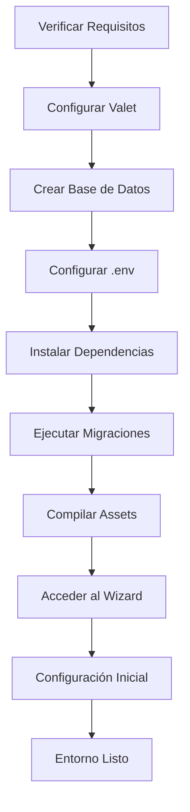

# Design Document - Configuración Local MagicAI

## Overview

Este documento describe el diseño técnico para configurar un entorno de desarrollo local completo de MagicAI usando Laravel Valet, incluyendo la configuración de base de datos, variables de entorno, y preparación para el desarrollo de extensiones.

## Architecture

### Entorno de Desarrollo Local
```
┌─────────────────────────────────────────────────────────────┐
│                    Entorno Local MagicAI                    │
├─────────────────────────────────────────────────────────────┤
│  Domain: https://tausepro.test (Laravel Valet + SSL)       │
│  ├─ PHP 8.3.22 (via Homebrew)                             │
│  ├─ MySQL 8.0+ (Base de datos: magicai_local)             │
│  ├─ Redis (Cache y sesiones)                              │
│  └─ Node.js 22.11.0 (Assets con Vite)                     │
├─────────────────────────────────────────────────────────────┤
│                    Estructura de Archivos                   │
│  ├─ .env (Configuración local)                            │
│  ├─ /public/build/ (Assets compilados)                    │
│  ├─ /storage/ (Logs, cache, uploads)                      │
│  ├─ /packages/ (Extensiones personalizadas)               │
│  └─ /database/ (Migraciones y seeders)                    │
└─────────────────────────────────────────────────────────────┘
```

### Flujo de Configuración


## Components and Interfaces

### 1. Configuración de Laravel Valet
- **Dominio**: `tausepro.test` con SSL automático
- **Directorio**: `/Users/tause/Documents/proyectos/tausepro9.4`
- **PHP Version**: 8.3.22
- **Nginx**: Configuración automática via Valet

### 2. Base de Datos MySQL
- **Nombre**: `magicai_local`
- **Charset**: `utf8mb4`
- **Collation**: `utf8mb4_unicode_ci`
- **Usuario**: `root` (sin contraseña para desarrollo local)
- **Host**: `127.0.0.1:3306`

### 3. Variables de Entorno (.env)
```env
# Aplicación
APP_NAME="MagicAI Local"
APP_ENV=local
APP_DEBUG=true
APP_URL=https://tausepro.test

# Base de Datos
DB_CONNECTION=mysql
DB_HOST=127.0.0.1
DB_PORT=3306
DB_DATABASE=magicai_local
DB_USERNAME=root
DB_PASSWORD=

# Cache y Sesiones
CACHE_DRIVER=file
SESSION_DRIVER=file
QUEUE_CONNECTION=sync

# Desarrollo
TELESCOPE_ENABLED=true
DEBUGBAR_ENABLED=true
```

### 4. Dependencias y Assets
- **Composer**: Dependencias PHP instaladas
- **NPM**: Dependencias JavaScript instaladas
- **Vite**: Build system para assets
- **Assets compilados**: `/public/build/`

## Data Models

### Estado de Migraciones
- **Total**: 200+ migraciones ejecutadas
- **Estado**: Todas las migraciones están al día
- **Tablas principales**:
  - `users` - Gestión de usuarios
  - `plans` - Planes de suscripción
  - `user_openai` - Generaciones de IA
  - `settings` - Configuraciones del sistema
  - `extensions` - Extensiones instaladas

### Estructura de Base de Datos
```sql
-- Tablas principales para desarrollo
users (id, name, email, type, team_id, ...)
plans (id, name, price, features, ai_models, ...)
user_openai (id, user_id, input, output, engine, model, ...)
settings (id, key, value, ...)
extensions (id, slug, name, version, active, ...)
```

## Error Handling

### Problemas Comunes y Soluciones

1. **Error de Conexión MySQL**
   - Verificar que MySQL esté ejecutándose: `brew services list | grep mysql`
   - Reiniciar MySQL: `brew services restart mysql`

2. **Error de Permisos en Storage**
   - Ejecutar: `chmod -R 775 storage bootstrap/cache`

3. **Error de Assets**
   - Limpiar y recompilar: `npm run build`
   - Verificar Node.js version: `node --version`

4. **Error de Cache**
   - Limpiar cache: `php artisan optimize:clear`

5. **Error de Valet**
   - Reinstalar certificados: `valet install`
   - Reenlazar dominio: `valet link tausepro`

### Logs de Desarrollo
- **Laravel Logs**: `storage/logs/laravel.log`
- **Valet Logs**: `~/.config/valet/Log/`
- **MySQL Logs**: Configurados en MySQL

## Testing Strategy

### Verificación del Entorno

1. **Test de Conectividad**
   ```bash
   curl -I https://tausepro.test
   # Debe retornar HTTP/2 200 o 302
   ```

2. **Test de Base de Datos**
   ```bash
   php artisan migrate:status
   # Todas las migraciones deben estar ejecutadas
   ```

3. **Test de Assets**
   ```bash
   ls -la public/build/
   # Debe contener archivos CSS y JS compilados
   ```

4. **Test de Artisan**
   ```bash
   php artisan --version
   # Debe mostrar la versión de Laravel
   ```

### Preparación para Extensiones

1. **Verificar Estructura de Packages**
   - Directorio `/packages/` accesible
   - Permisos de escritura configurados

2. **Verificar Autoload**
   - Composer autoload actualizado
   - Packages personalizados cargados

3. **Verificar Service Providers**
   - Providers de extensiones registrados
   - Configuraciones cargadas correctamente

## Configuración Adicional

### Herramientas de Desarrollo
- **Laravel Telescope**: Habilitado para debugging
- **Laravel Debugbar**: Habilitado para desarrollo
- **Laravel Ray**: Disponible para debugging avanzado

### Optimizaciones Locales
- Cache de archivos (no Redis para simplicidad)
- Queue síncrono (no workers para desarrollo)
- Mail trap con Mailpit
- Assets en modo desarrollo

### Preparación para Extensiones
- Directorio `/packages/` configurado
- Autoload de Composer actualizado
- Service providers listos para extensiones
- Rutas personalizadas habilitadas