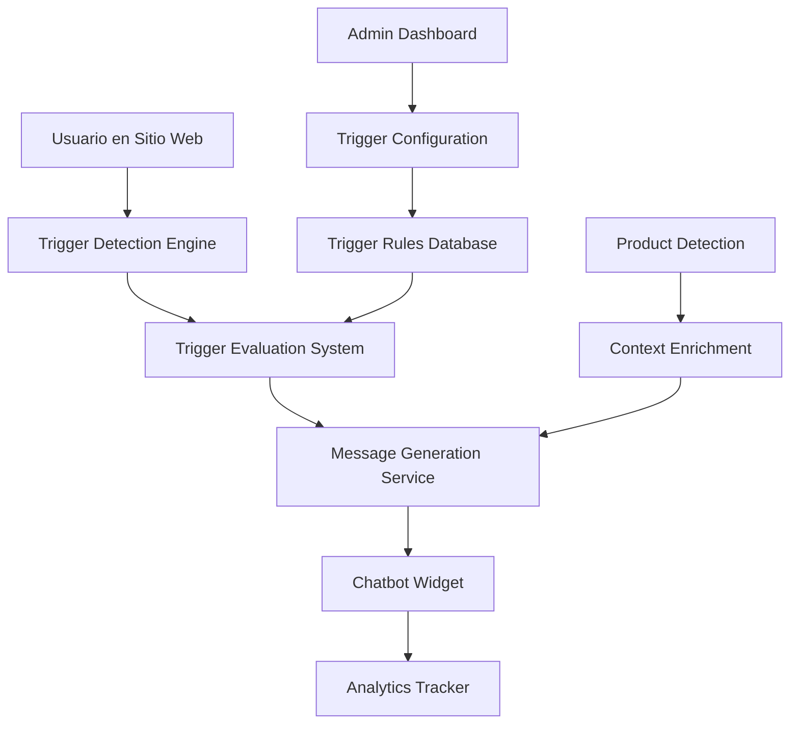

# Design Document

## Overview

El Sistema de Triggers Proactivos transforma el chatbot embebido de MagicAI en un agente de ventas virtual inteligente que detecta comportamientos específicos del usuario y activa automáticamente mensajes contextuales para maximizar engagement y conversiones.

## Architecture

### High-Level Architecture



### Core Components

1. **Trigger Detection Engine**: JavaScript que monitorea comportamiento del usuario
2. **Trigger Evaluation System**: Backend que evalúa reglas y decide qué triggers activar
3. **Message Generation Service**: Genera mensajes contextuales personalizados
4. **Configuration Dashboard**: Interfaz para configurar triggers en el wizard
5. **Analytics System**: Trackea efectividad de triggers

## Components and Interfaces

### 1. Frontend Trigger Detection Engine

#### JavaScript Tracker (`chatbot-triggers.js`)

```javascript
class ProactiveTriggerEngine {
    constructor(chatbotId, config) {
        this.chatbotId = chatbotId;
        this.config = config;
        this.userSession = new UserSessionTracker();
        this.triggers = new TriggerManager();
        this.analytics = new TriggerAnalytics();
    }

    // Detectores de comportamiento
    initializeBehaviorDetectors() {
        this.setupTimeBasedTriggers();
        this.setupExitIntentDetection();
        this.setupPageContextTriggers();
        this.setupNavigationTriggers();
        this.setupProductContextTriggers();
    }

    // Triggers basados en tiempo
    setupTimeBasedTriggers() {
        // Welcome trigger (30s)
        setTimeout(() => {
            if (!this.userSession.hasInteracted()) {
                this.evaluateTrigger('welcome_30s');
            }
        }, 30000);

        // Page dwell trigger (2min)
        setTimeout(() => {
            if (this.userSession.getCurrentPageTime() > 120000) {
                this.evaluateTrigger('page_dwell_2min');
            }
        }, 120000);
    }

    // Detección de intención de salida
    setupExitIntentDetection() {
        document.addEventListener('mouseleave', (e) => {
            if (e.clientY <= 0) {
                this.evaluateTrigger('exit_intent');
            }
        });

        // Detección de abandono de carrito
        this.detectCartAbandonment();
    }

    // Triggers contextuales por página
    setupPageContextTriggers() {
        const pageType = this.detectPageType();
        const products = this.detectPageProducts();
        
        setTimeout(() => {
            this.evaluateTrigger(`page_context_${pageType}`, {
                products: products,
                pageUrl: window.location.href
            });
        }, 15000);
    }
}
```

#### User Session Tracker

```javascript
class UserSessionTracker {
    constructor() {
        this.sessionData = {
            startTime: Date.now(),
            pageViews: [],
            interactions: [],
            cartActions: [],
            searchQueries: [],
            isNewVisitor: this.checkIfNewVisitor(),
            customerTier: this.getCustomerTier()
        };
    }

    trackPageView(url, products = []) {
        this.sessionData.pageViews.push({
            url: url,
            timestamp: Date.now(),
            timeSpent: 0,
            products: products,
            scrollDepth: 0
        });
    }

    trackInteraction(type, data) {
        this.sessionData.interactions.push({
            type: type,
            data: data,
            timestamp: Date.now()
        });
    }

    hasInteracted() {
        return this.sessionData.interactions.length > 0;
    }

    getCurrentPageTime() {
        const currentPage = this.sessionData.pageViews[this.sessionData.pageViews.length - 1];
        return Date.now() - currentPage.timestamp;
    }
}
```

### 2. Backend Trigger Evaluation System

#### Trigger Evaluation Service

```php
<?php

namespace App\Extensions\Chatbot\System\Services;

class ProactiveTriggerService
{
    protected $triggerRules;
    protected $messageGenerator;
    protected $analytics;

    public function evaluateTrigger(string $triggerType, array $context, string $chatbotId): ?array
    {
        $trigger = $this->getTriggerConfiguration($chatbotId, $triggerType);
        
        if (!$trigger || !$trigger->is_active) {
            return null;
        }

        // Evaluar condiciones del trigger
        if (!$this->evaluateTriggerConditions($trigger, $context)) {
            return null;
        }

        // Verificar frecuencia y cooldown
        if (!$this->checkTriggerFrequency($trigger, $context['sessionId'])) {
            return null;
        }

        // Generar mensaje contextual
        $message = $this->messageGenerator->generateTriggerMessage($trigger, $context);

        // Registrar activación para analytics
        $this->analytics->recordTriggerActivation($trigger, $context);

        return [
            'trigger_id' => $trigger->id,
            'message' => $message,
            'action' => $trigger->action,
            'priority' => $trigger->priority,
            'display_config' => $trigger->display_config
        ];
    }

    protected function evaluateTriggerConditions(ChatbotTrigger $trigger, array $context): bool
    {
        foreach ($trigger->conditions as $condition) {
            if (!$this->evaluateCondition($condition, $context)) {
                return false;
            }
        }
        return true;
    }

    protected function evaluateCondition(array $condition, array $context): bool
    {
        switch ($condition['type']) {
            case 'page_type':
                return $this->evaluatePageTypeCondition($condition, $context);
            case 'product_category':
                return $this->evaluateProductCategoryCondition($condition, $context);
            case 'user_tier':
                return $this->evaluateUserTierCondition($condition, $context);
            case 'time_range':
                return $this->evaluateTimeRangeCondition($condition, $context);
            case 'cart_value':
                return $this->evaluateCartValueCondition($condition, $context);
            default:
                return true;
        }
    }
}
```

#### Message Generation Service

```php
<?php

namespace App\Extensions\Chatbot\System\Services;

class TriggerMessageGenerator
{
    protected $openAIService;
    protected $productService;

    public function generateTriggerMessage(ChatbotTrigger $trigger, array $context): string
    {
        $baseMessage = $trigger->message_template;
        
        // Personalizar mensaje según contexto
        $personalizedMessage = $this->personalizeMessage($baseMessage, $context);
        
        // Enriquecer con información de productos si aplica
        if ($context['products'] ?? false) {
            $personalizedMessage = $this->enrichWithProductInfo($personalizedMessage, $context['products']);
        }

        // Aplicar tono y estilo del chatbot
        return $this->applyBrandVoice($personalizedMessage, $trigger->chatbot);
    }

    protected function personalizeMessage(string $template, array $context): string
    {
        $replacements = [
            '{user_name}' => $context['user_name'] ?? 'amigo',
            '{product_name}' => $context['current_product']['name'] ?? '',
            '{category_name}' => $context['category'] ?? '',
            '{discount_amount}' => $context['discount'] ?? '10%',
            '{cart_value}' => $context['cart_value'] ?? '',
            '{time_of_day}' => $this->getTimeOfDayGreeting(),
        ];

        return str_replace(array_keys($replacements), array_values($replacements), $template);
    }

    protected function enrichWithProductInfo(string $message, array $products): string
    {
        if (empty($products)) {
            return $message;
        }

        $product = $products[0]; // Usar primer producto como contexto principal
        
        $enrichments = [
            'benefits' => $this->getProductBenefits($product),
            'usage_tips' => $this->getUsageTips($product),
            'complementary_products' => $this->getComplementaryProducts($product),
        ];

        // Agregar información contextual al mensaje
        return $message . $this->formatProductEnrichment($enrichments);
    }
}
```

### 3. Database Schema

#### Triggers Configuration Table

```sql
CREATE TABLE ext_chatbot_triggers (
    id BIGINT UNSIGNED AUTO_INCREMENT PRIMARY KEY,
    chatbot_id BIGINT UNSIGNED NOT NULL,
    trigger_type VARCHAR(50) NOT NULL,
    name VARCHAR(100) NOT NULL,
    message_template TEXT NOT NULL,
    conditions JSON,
    action VARCHAR(50) DEFAULT 'show_message',
    priority INT DEFAULT 5,
    is_active BOOLEAN DEFAULT true,
    frequency_limit INT DEFAULT NULL,
    cooldown_minutes INT DEFAULT 60,
    display_config JSON,
    created_at TIMESTAMP DEFAULT CURRENT_TIMESTAMP,
    updated_at TIMESTAMP DEFAULT CURRENT_TIMESTAMP ON UPDATE CURRENT_TIMESTAMP,
    
    FOREIGN KEY (chatbot_id) REFERENCES ext_chatbots(id) ON DELETE CASCADE,
    INDEX idx_chatbot_trigger_type (chatbot_id, trigger_type),
    INDEX idx_active_triggers (is_active, priority)
);
```

#### Trigger Analytics Table

```sql
CREATE TABLE ext_chatbot_trigger_analytics (
    id BIGINT UNSIGNED AUTO_INCREMENT PRIMARY KEY,
    trigger_id BIGINT UNSIGNED NOT NULL,
    session_id VARCHAR(100) NOT NULL,
    user_id BIGINT UNSIGNED NULL,
    activated_at TIMESTAMP DEFAULT CURRENT_TIMESTAMP,
    user_responded BOOLEAN DEFAULT false,
    response_type VARCHAR(50) NULL,
    conversion_achieved BOOLEAN DEFAULT false,
    conversion_value DECIMAL(10,2) NULL,
    context_data JSON,
    
    FOREIGN KEY (trigger_id) REFERENCES ext_chatbot_triggers(id) ON DELETE CASCADE,
    INDEX idx_trigger_analytics (trigger_id, activated_at),
    INDEX idx_conversion_tracking (conversion_achieved, conversion_value)
);
```

### 4. Configuration Interface

#### Wizard Integration

Nuevo paso en el wizard: **"Agent Triggers"** entre "Train" y "Embed"

```php
// resources/views/chatbot/edit-steps/edit-step-triggers.blade.php
<div class="trigger-configuration-panel">
    <h3>🤖 Configure Agent Triggers</h3>
    
    <!-- Time-based Triggers -->
    <div class="trigger-category">
        <h4>⏱️ Time-based Triggers</h4>
        <div class="trigger-item">
            <label>
                <input type="checkbox" wire:model="triggers.welcome_30s.enabled">
                Welcome message (30s)
            </label>
            <input type="text" wire:model="triggers.welcome_30s.message" 
                   placeholder="¡Hola! ¿Te puedo ayudar a encontrar algo específico? 😊">
        </div>
        
        <div class="trigger-item">
            <label>
                <input type="checkbox" wire:model="triggers.exit_intent.enabled">
                Exit intent offer
            </label>
            <input type="text" wire:model="triggers.exit_intent.message" 
                   placeholder="¡Espera! ¿Te gustaría un {discount_amount} de descuento?">
        </div>
    </div>

    <!-- Page-based Triggers -->
    <div class="trigger-category">
        <h4>📍 Page-based Triggers</h4>
        <div class="trigger-item">
            <label>
                <input type="checkbox" wire:model="triggers.product_page.enabled">
                Product page assistance
            </label>
            <input type="text" wire:model="triggers.product_page.message" 
                   placeholder="¿Te interesa {product_name}? Puedo contarte más detalles">
        </div>
    </div>

    <!-- Smart Triggers -->
    <div class="trigger-category">
        <h4>🎯 Smart Triggers</h4>
        <div class="trigger-item">
            <label>
                <input type="checkbox" wire:model="triggers.skincare_consultation.enabled">
                Skincare consultation
            </label>
            <input type="text" wire:model="triggers.skincare_consultation.message" 
                   placeholder="¿Conoces tu tipo de piel? Puedo recomendarte la rutina perfecta">
        </div>
    </div>
</div>
```

## Data Models

### ChatbotTrigger Model

```php
<?php

namespace App\Extensions\Chatbot\System\Models;

class ChatbotTrigger extends Model
{
    protected $table = 'ext_chatbot_triggers';
    
    protected $fillable = [
        'chatbot_id', 'trigger_type', 'name', 'message_template',
        'conditions', 'action', 'priority', 'is_active',
        'frequency_limit', 'cooldown_minutes', 'display_config'
    ];

    protected $casts = [
        'conditions' => 'array',
        'display_config' => 'array',
        'is_active' => 'boolean'
    ];

    public function chatbot()
    {
        return $this->belongsTo(Chatbot::class);
    }

    public function analytics()
    {
        return $this->hasMany(ChatbotTriggerAnalytic::class, 'trigger_id');
    }

    public function getConversionRateAttribute()
    {
        $total = $this->analytics()->count();
        $conversions = $this->analytics()->where('conversion_achieved', true)->count();
        
        return $total > 0 ? ($conversions / $total) * 100 : 0;
    }
}
```

## Error Handling

### Frontend Error Handling

```javascript
class TriggerErrorHandler {
    static handleTriggerError(error, triggerType) {
        console.warn(`Trigger error [${triggerType}]:`, error);
        
        // Fallback silencioso - no interrumpir experiencia del usuario
        if (error.type === 'network') {
            // Reintentar después de delay
            setTimeout(() => {
                this.retryTrigger(triggerType);
            }, 5000);
        }
        
        // Reportar error para analytics
        this.reportTriggerError(error, triggerType);
    }
}
```

### Backend Error Handling

```php
try {
    $triggerResponse = $this->triggerService->evaluateTrigger($triggerType, $context, $chatbotId);
} catch (TriggerEvaluationException $e) {
    Log::warning('Trigger evaluation failed', [
        'trigger_type' => $triggerType,
        'chatbot_id' => $chatbotId,
        'error' => $e->getMessage()
    ]);
    
    // Retornar respuesta por defecto o null
    return $this->getDefaultTriggerResponse($triggerType);
}
```

## Testing Strategy

### Unit Tests

```php
class ProactiveTriggerServiceTest extends TestCase
{
    public function test_welcome_trigger_activates_after_30_seconds()
    {
        $context = [
            'session_time' => 35000,
            'has_interacted' => false,
            'is_new_visitor' => true
        ];
        
        $result = $this->triggerService->evaluateTrigger('welcome_30s', $context, $this->chatbot->id);
        
        $this->assertNotNull($result);
        $this->assertStringContains('Hola', $result['message']);
    }

    public function test_exit_intent_trigger_offers_discount()
    {
        $context = [
            'trigger_event' => 'exit_intent',
            'cart_value' => 50000,
            'is_new_visitor' => true
        ];
        
        $result = $this->triggerService->evaluateTrigger('exit_intent', $context, $this->chatbot->id);
        
        $this->assertNotNull($result);
        $this->assertStringContains('descuento', strtolower($result['message']));
    }
}
```

### Integration Tests

```php
class TriggerIntegrationTest extends TestCase
{
    public function test_complete_trigger_flow()
    {
        // Simular comportamiento del usuario
        $this->visit('/producto/crema-facial')
             ->wait(16) // Esperar más de 15 segundos
             ->seeElement('.chatbot-proactive-message')
             ->see('¿Te interesa este producto?');
    }
}
```

### Frontend Tests

```javascript
describe('Proactive Trigger Engine', () => {
    test('should activate welcome trigger after 30 seconds', async () => {
        const engine = new ProactiveTriggerEngine('test-chatbot', mockConfig);
        
        jest.advanceTimersByTime(31000);
        
        expect(mockTriggerEvaluation).toHaveBeenCalledWith('welcome_30s');
    });

    test('should detect exit intent on mouse leave', () => {
        const engine = new ProactiveTriggerEngine('test-chatbot', mockConfig);
        
        fireEvent.mouseLeave(document, { clientY: -10 });
        
        expect(mockTriggerEvaluation).toHaveBeenCalledWith('exit_intent');
    });
});
```

## Performance Considerations

### Frontend Optimization

- **Debouncing**: Evitar triggers excesivos con debounce de 500ms
- **Lazy Loading**: Cargar engine solo cuando sea necesario
- **Memory Management**: Limpiar listeners al cambiar de página
- **Batch Processing**: Agrupar múltiples eventos para evaluación

### Backend Optimization

- **Caching**: Cache de configuraciones de triggers por chatbot
- **Queue Processing**: Procesar analytics de triggers en background
- **Database Indexing**: Índices optimizados para consultas frecuentes
- **Rate Limiting**: Limitar frecuencia de triggers por usuario

## Security Considerations

- **Input Validation**: Validar todos los datos de contexto del frontend
- **Rate Limiting**: Prevenir spam de triggers
- **Data Privacy**: No almacenar información sensible en contexto
- **XSS Prevention**: Sanitizar mensajes generados dinámicamente